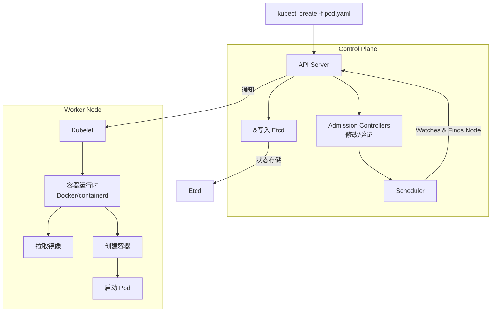
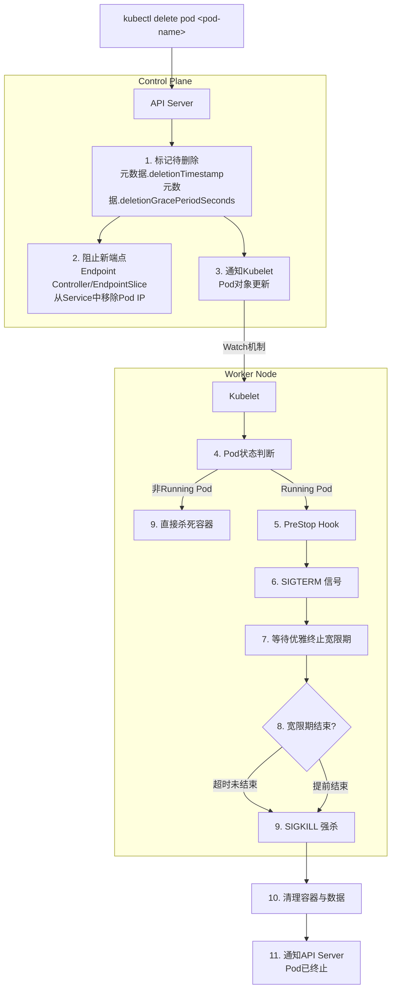

## Pod详解

### Pod的创建过程

在 Kubernetes 中，Pod 的创建是一个多组件协同的过程，涉及 API Server、调度器（kube-scheduler）、kubelet、容器运行时（如 containerd）等核心组件。以下是 Pod 创建的完整流程，从用户提交请求到容器启动的每一步细节：  

**一、触发Pod创建的方式**

1. 直接提交 Pod 配置清单（`kubectl apply -f pod.yaml`）。
2. 由工作负载控制器（Deployment、StatefulSet、DaemonSet 等）自动创建（控制器根据 `replicas` 字段确保期望副本数）。
3. 临时任务（Job）或定时任务（CronJob）创建的 Pod。

**二、Pod 创建的完整流程**

**阶段一：用户提交请求**

1. **用户提交创建请求**
   - 用户编写yaml配置文件
   - 通过 `kubectl` 命令（如 `kubectl apply -f pod.yaml`）向 **API Server** 发送 Pod 创建请求。

**阶段二：API Server 验证并存储 Pod 信息**

2. **认证与授权**：API Server 首先验证请求的合法性（身份认证，RBAC权限，语法检查）
   - **认证**：API Server 接收请求后，首先进行身份认证，确认请求者的身份是否合法（例如，使用证书、Token等）。
   - **授权**：接着进行授权，检查该用户是否有权限创建 Pod（例如，使用 RBAC）
3. **准入控制**：通过一系列**准入控制器**，这些控制器完成对pod配置的校验与修改。

4. **存储到 etcd**：验证通过后，API Server 将 Pod 的配置信息（`spec`）存储到 **etcd** 中，此时 Pod 状态为 `Pending`（未调度），`status` 字段为空。

**阶段三：调度器（kube-scheduler）绑定节点**

5. **监听待调度 Pod**
   - 调度器通过监听 API Server 中状态为 `Pending` 且未分配节点（`spec.nodeName` 为空）的 Pod。
6. **筛选合适节点**：调度器对所有可用节点执行 两步调度算法：
   - **预选（Predicates）**：过滤不满足 Pod 要求的节点（如cpu内存资源不足、节点污点与 Pod 容忍度不匹配、节点亲和性规则等）。
   - **优选（Priorities）**：对通过的节点打分（如资源剩余量、负载均衡、节点亲和性权重等），选择得分最高的节点。
7. **绑定节点**
   - 调度器向 API Server 发送 **绑定请求**，将 Pod 的 `spec.nodeName` 字段更新为选中的节点名称
   - API Server 更新 etcd 中Pod的节点绑定信息。

**阶段四：Kubelet 创建 Pod**

8. **kubelet 监听并创建 Pod**
   - 每个节点上的 **kubelet** 会定期向 API Server 查询 “分配给本节点的 Pod”（通过 `spec.nodeName` 匹配自身节点名）。并且其状态为pending，确认需要在本地创建。
9. **kubelet 准备 Pod 运行环境**
   - **创建网络命名空间**：为 Pod 分配独立的网络命名空间（确保 Pod 内容器共享网络栈）。
   - **配置网络**：调用 **CNI 插件**（如 Calico、Flannel）为 Pod 分配 IP 地址、配置路由、设置 veth 对（连接 Pod 与节点网络），确保 Pod 能与集群内其他 Pod 通信。
   - **挂载存储卷**：根据 Pod 的 `spec.volumes` 配置，挂载所需的存储（如 emptyDir、ConfigMap、Secret、PersistentVolume 等），确保容器能访问指定的文件或数据。
10. **拉取镜像**
    - kubelet 通过 容器运行时接口（CRI） 调用容器运行时（如 containerd、CRI-O），根据 Pod 中 spec.containers.image 字段拉取所需镜像
11. **启动容器**
    - 容器运行时根据kubelet传递的配置（如镜像、环境变量、资源限制、挂载卷等）启动容器：
      - 先启动 **init容器**（若有），按顺序执行，全部成功后才启动主容器；
      - 再启动 **pause容器**，它为pod创建网络和pid的名称空间，提供基础设施，并在pod整个生命周期内运行
      - 启动 **主容器**（`containers` 字段定义的容器），多个主容器并行启动。
    - 容器启动后，容器运行时向 kubelet 反馈容器状态（如 `Running`、`Error`）

12. **更新 Pod 状态并持续监控**
    - **更新状态**：kubelet 收集容器运行状态，通过 API Server 更新 etcd 中的 Pod 状态（如 `status.phase` 改为 `Running`，`status.conditions` 记录容器就绪状态等）。
    - **持续监控**：kubelet 通过 **容器运行时** 持续监控容器状态（如健康检查 `livenessProbe`、就绪检查 `readinessProbe`），若容器异常退出，根据重启策略（`restartPolicy`）处理。
    - 用户可见：此时通过 `kubectl get pods` 可看到 Pod 状态为 `Running`，表示创建完成。

### Pod的删除过程

在 Kubernetes 中，Pod 的删除过程（删除）过程是一个**有序的终止流程**，涉及多个组件协同工作（如 API Server、kubelet、容器运行时等），目的是确保应用优雅退出，减少服务中断。以下是详细的删除过程和关键机制：

**一、Pod 删除的触发方式**

1. 手动执行命令：`kubectl delete pod <pod-name>`
2. 控制器（如 Deployment/StatefulSet）调整副本数（如 `replicas: 0`）或更新配置（如滚动更新时删除旧 Pod）
3. 节点故障后，控制器在其他节点重建 Pod，旧 Pod 被标记为 `Terminating` 后删除
4. 超过 `ttlSecondsAfterFinished` 配置（适用于 Job 生成的 Pod，完成后自动删除）

**二、Pod 删除的完整流程**

**阶段一：用户请求与API Server处理**

1. **用户发起删除请求**

   - 用户或控制器向 API Server 发送 Pod 删除请求（如 `kubectl delete`）。

2. **API Server 标记Pod为"待删除"**

   - API Server 不会立即从 Etcd 中删除这个 Pod 对象，而是会进行两项关键修改：
     - 设置 `metadata.deletionTimestamp` 字段为当前时间。
     - 设置 `metadata.deletionGracePeriodSeconds` 字段（默认为30秒，可通过 `kubectl delete --grace-period=30` 指定），这就是**优雅终止宽限期**。
   - 此时，Pod 的状态变为 `Terminating`

**阶段二：控制平面协调**

3. **从 Service 端点中移除**

   - API Server 中的 etcd 存储更新 Pod 状态后，通过 **Informer 机制** 通知所有监听 Pod 变化的组件（如 kubelet、控制器、网络插件等）：“该 Pod 即将被删除”。
   - **Endpoint Controller** 监控到 Pod 即将删除（发现 Pod 被标记为 `Terminating` ），会移除 Service 对象中与此 Pod 关联的 Endpoint 对象，这样流量就不会调度到这个pod

4. **Kubelet 监视到变化**

   - 目标节点上的 Kubelet 通过 Watch 机制，从 API Server 得知它所管理的这个 Pod 被标记为 `Terminating`，于是开始终止pod

**阶段三：节点上的优雅终止**

5. **Kubelet 判断 Pod 状态**
   - 如果 Pod 还未启动（例如 `Pending`），Kubelet 会直接开始清理。
   - 如果 Pod 已经处于运行（`Running`）或失败（`Failed`）状态，则进入优雅终止流程。
6. **执行 PreStop 钩子（若配置）**

   - kubelet 首先调用 Pod 中的 `preStop` 钩子。
   - PreStop 是容器终止前的自定义操作（如关闭连接、保存状态、通知其他服务等），`preStop` 钩子的执行时间包含在优雅终止宽限期内。
   - 若 PreStop 执行时间超过宽限期，kubelet 会在宽限期结束后强制终止容器。

7. **发送 SIGTERM 信号（优雅终止）**

   - 宽限期内，kubelet 通过容器运行时（如 containerd）向容器内的主进程发送`SIGTERM`信号，通知应用 “优雅退出”。
   - 应用收到信号后应主动关闭资源（如释放文件句柄、断开数据库连接）并退出。

8. **宽限期结束，发送 SIGKILL 信号（强制终止）**

   - 若容器在宽限期后仍在运行（如应用未处理 SIGTERM），kubelet 会发送 **SIGKILL 信号**，强制终止容器进程。该`SIGKILL`信号无法被捕获或忽略。
   - 容器运行时删除容器的相关资源（如命名空间、网络接口等）。

**阶段四：清理与通知**

9. **清理资源**

   - 所有容器停止后，Kubelet 会清理 Pod 占用的所有资源，例如：
   - 删除 Pod 的容器。
   - 清理容器的日志和存储卷（如`emptyDir`会被删除，持久卷`PV`会根据回收策略处理）。
   - 释放 IP 地址等网络资源。

10. **从 API Server 移除**

   - kubelet 向 API Server 发送 “Pod 已完全终止” 的通知，API Server 从 etcd 中删除该 Pod 的记录。
   - 此时 `kubectl get pods` 不再显示该 Pod（除非使用 `kubectl get pods --show-deleted`）。
